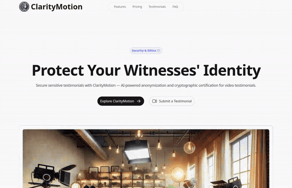

[](https://github.com/salim-lakhal/ClarityMotion/actions/workflows/ci.yml)


# ClarityMotion

[](https://github.com/salim-lakhal/ClarityMotion/releases/download/v1.0/demo.mp4)
> *Click to watch full quality video*

Secure testimonial management platform for media organizations and investigative teams. ClarityMotion anonymizes witness identity in video testimonials using AI while certifying content authenticity through cryptographic proofs.

## Features

- **Testimonial Submission** — Encrypted form for witnesses to submit testimonials securely
- **Dashboard** — Review, verify, and manage submitted testimonials with status tracking
- **AI Anonymization** — Face and voice obfuscation to protect witness identity
- **Cryptographic Certification** — Tamper-proof certificates proving testimonial authenticity
- **Content-Driven Landing** — YAML-based content management for marketing pages
- **Dark Mode** — Full dark/light theme support
- **Server API** — RESTful API for testimonials CRUD and newsletter subscriptions
- **Responsive Design** — Mobile-first layout with Nuxt UI Pro components

## Tech Stack

| Layer | Technology |
|-------|-----------|
| Framework | Nuxt 3, Vue 3 Composition API |
| UI | Nuxt UI Pro, Tailwind CSS, Heroicons |
| Content | @nuxt/content (YAML) |
| Server | Nitro (Nuxt server engine) |
| Testing | Vitest, happy-dom |
| Linting | ESLint with @nuxt/eslint |
| CI/CD | GitHub Actions |

## Project Structure

```
app/
├── pages/
│   ├── index.vue          # Landing page (hero, features, pricing, testimonials, FAQ)
│   ├── submit.vue         # Testimonial submission form
│   ├── dashboard.vue      # Testimonial management dashboard
│   └── demos.vue          # Video demo showcase
├── components/
│   ├── AppHeader.vue      # Navigation with scrollspy
│   ├── AppFooter.vue      # Footer with newsletter signup
│   ├── DemoCard.vue       # Video modal component
│   └── ImagePlaceholder.vue
└── app.config.ts          # UI theme configuration

server/
├── api/
│   ├── testimonials/      # GET/POST testimonials
│   └── newsletter.post.ts # Newsletter subscription
└── utils/
    └── store.ts           # Data store with TypeScript interfaces

content/
└── index.yml              # Landing page content (YAML)
```

## API Endpoints

| Method | Endpoint | Description |
|--------|----------|-------------|
| `GET` | `/api/testimonials` | List all testimonials |
| `GET` | `/api/testimonials/:id` | Get a specific testimonial |
| `POST` | `/api/testimonials` | Submit a new testimonial |
| `POST` | `/api/newsletter` | Subscribe to newsletter |

## Setup

```bash
# Install dependencies
pnpm install

# Start dev server (http://localhost:3000)
pnpm dev

# Run tests
pnpm test

# Lint
pnpm lint

# Build for production
pnpm build
```

> Requires a [Nuxt UI Pro license](https://ui.nuxt.com/pro/purchase). Set `NUXT_UI_PRO_LICENSE` in your `.env` file.

## License

[MIT](./LICENSE)
